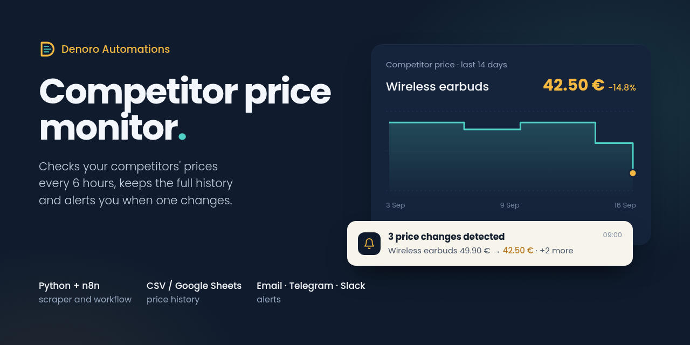

# Competitor Price & Stock Monitor

**Denoro Automations** · Stop checking competitor stores by hand. This monitor checks their catalogue on a schedule and sends you **one summary** on Telegram and by email when something important changes.



## What it detects

| Alert | Example |
|---|---|
| 🔻 **A competitor undercuts you** | "Organic tee: €21.90 vs your €24.90 (-12%)" |
| 📉 / 📈 **Price drops and rises** | only changes above your threshold (e.g. ≥1%) |
| ⛔ / ✅ **Out of stock / back in stock** | the right moment to push your own ads |
| 🆕 / 🗑️ **New and removed products** | spot catalogue changes early |

Every alert includes the full current price list as a **CSV** (opens in Excel), and the history is kept so you can chart trends.

## Supported stores

| Type | How it reads the data | Setup |
|---|---|---|
| `shopify` | public `/products.json` feed | just the store URL |
| `woocommerce` | public Store API (`/wp-json/wc/store/v1/products`) | just the store URL |
| `css` | any HTML catalogue, using CSS selectors | 4–5 selectors |

It is built to be polite and reliable: it follows `robots.txt`, waits between requests, retries on `429/5xx` errors, stops if pagination loops, and **does not report products as "removed" when a site only partly loads**. It only reads public, non-personal data.

## Two ways to run it

### A) n8n (no code, recommended for store owners)
1. In n8n: **Import from File** → `n8n-workflow.json` and `n8n-error-workflow.json`.
2. Edit the **CONFIGURATION** block in the *Configuración* node (stores, your prices, and `email_to` / `email_from` / `telegram_chat_id`). The workflow stops with a clear message while the example values are still there; leave a channel empty (`''`) to turn it off.
3. Choose your credentials in **Telegram** and **Enviar email** (SMTP; with Gmail, use an app password).
4. Under *Settings → Error workflow*, choose **Denoro — Avisos de error** so you are told if anything breaks.
5. Activate the workflow (it runs every 6 hours by default).

> n8n only keeps the price history for **active** runs, not manual test runs. That is why `modo_demo: true` simulates a few changes when there is no history yet. Set it to `false` for real clients.

### B) Python (servers, cron, Docker)
```bash
pip install -r requirements.txt
cp config.example.yaml config.yaml      # stores, your prices, thresholds
cp .env.example .env                    # Telegram + SMTP credentials
python monitor.py --config config.yaml  # add --no-notify for a dry run
```
Outputs in `data/`: `history.sqlite` (full history), `price_history.csv` (last 90 days), `last_report.json` and `last_report.html`.

With Docker:
```bash
docker build -t denoro-monitor .
docker run --rm --env-file .env -v "$PWD/config.yaml:/app/config.yaml" -v "$PWD/data:/app/data" denoro-monitor
```
Schedule it with cron (`0 */6 * * *`) or Windows Task Scheduler.

### Example config
```yaml
sources:
  - id: rival-shop
    type: shopify
    url: https://rival-shop.com
    currency: EUR
my_products:
  - name: Organic tee
    my_price: 24.90
    tolerance_pct: 2
    competitors:
      rival-shop: organic-cotton-tee    # Shopify handle, SKU or product URL
alerts:
  min_change_pct: 1.0
```

## Quality
- 30 automated tests (`python -m pytest`): price parsing in EU/US formats, the three connectors, change detection, retries, `robots.txt`, notifications and end-to-end runs.
- The n8n JavaScript lives in `n8n/src/` and is tested outside n8n (`node n8n/test/test_price_monitor.js`). `python n8n/build.py` rebuilds the workflow JSON from it.

## Project layout
```
denoro_monitor/   connectors, storage (SQLite), change detection, reports, notifications
tests/            pytest suite with offline fixtures
n8n/              source code and tests for the n8n version
n8n-workflow.json, n8n-error-workflow.json
```

## Multi-client version (SaaS)
Each client gets a private panel where they paste the links they want to watch — a whole Shopify/WooCommerce store or single product pages from any shop — and chooses where to get the alerts. See [SAAS.md](SAAS.md) (Spanish).

## Want this for your store?
Setup for up to 3 competitor sites, custom alerts and weekly reports. Contact me on [Upwork](https://www.upwork.com/) or open an issue.

*Demo data comes from books.toscrape.com, a public website built for scraping practice.*
